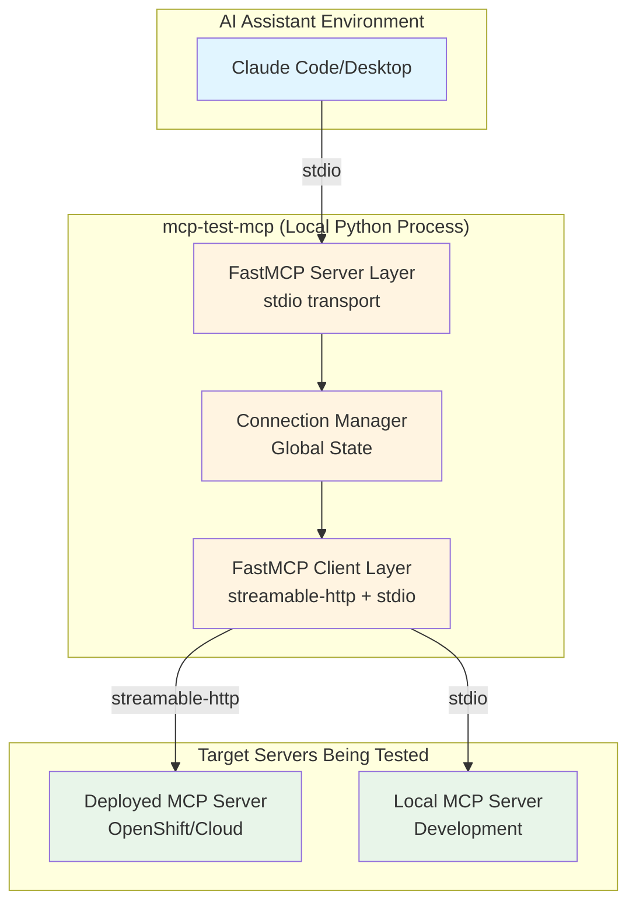
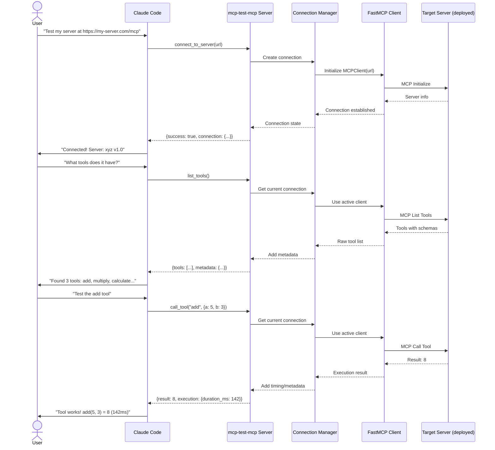

# Technical Proposal: mcp-test-mcp

**Project:** mcp-test-mcp
**Date:** 2025-10-09
**Status:** Draft for Review
**Version:** 1.0

---

## Executive Summary

### Overview

**mcp-test-mcp** is an MCP server that enables AI assistants (Claude Code, Claude Desktop, etc.) to test other MCP servers natively through the MCP protocol. It acts as a bridge - appearing as a standard MCP server to AI assistants while internally functioning as an MCP client to connect to and test target servers.

### The Problem Being Solved

MCP is new (2024) and AI models have not seen enough production-grade MCP code in their training. When developers ask AI assistants to test MCP servers, the AI tries familiar patterns (curl, REST APIs) which fail. The AI then assumes the MCP code is broken and "fixes" it by converting to REST/WebSocket patterns, causing **days of rework** for developers.

mcp-test-mcp breaks this broken loop by giving AI assistants native MCP testing capabilities.

### Key Technical Decisions

1. **Architecture**: FastMCP v2 for both server (stdio) and client (streamable-http + stdio) components
2. **Connection Model**: Simple global state (one active connection at a time) for MVP
3. **Transport Priority**: Streamable-http for deployed servers (primary use case), stdio for local servers (secondary)
4. **Verbosity**: Full schemas and metadata in all responses to prevent AI hallucination
5. **Authentication**: Deferred to Phase 2 (start with public/network-accessible servers)
6. **Deployment**: Local-only Python package (not a deployed service)

### Implementation Timeline Estimate

- **Phase 1 (MVP)**: 2-3 weeks - Core functionality for deployed server testing
- **Phase 2**: 1-2 weeks - Authentication and polish
- **Phase 3**: 1-2 weeks - Local server support and advanced features

**Total MVP to Production**: 4-7 weeks with 1-2 developers

---

## Problem Statement

### Current State

MCP servers cannot be tested like REST APIs:
- REST APIs have `/docs` endpoints you can click around
- MCP servers require specialized MCP clients speaking stdio or streamable-http protocols
- Standard testing tools (curl, Postman, httpie) don't work with MCP

### The Broken Loop

When developers ask AI assistants to help test MCP servers:

1. Developer asks: "Can you test this MCP server?"
2. AI tries curl (makes HTTP requests that don't work with MCP protocol)
3. Commands fail (because MCP isn't REST/HTTP)
4. AI assumes code is broken ("since curl doesn't work, the server must be wrong")
5. AI "fixes" it by converting MCP code to REST/WebSocket patterns
6. Developer loses days fixing the "fix"

### Why This Happens

- MCP is new (2024) with limited production code in AI training data
- AI models haven't seen enough correct MCP patterns
- They fall back to familiar patterns (REST, WebSocket)
- No way for AI to actually test MCP servers correctly

### Who This Impacts

- **MCP Server Developers**: Can't get AI help testing servers, lose time to incorrect "fixes"
- **AI Assistants**: Want to help but can't interact with MCP, provide incorrect guidance
- **Development Teams**: Slower MCP adoption due to testing friction, higher cognitive load

### Success Criteria

We'll know this works when:
1. AI can connect to deployed MCP servers
2. AI can list tools with full schemas (verifiable, not hallucinated)
3. AI can call tools and get results with execution metadata
4. AI can verify "this server works" without converting to REST
5. Developers trust the output (detailed enough to verify)
6. No more days lost to the broken loop

---

## Proposed Solution

### Architectural Overview

mcp-test-mcp operates as a **dual-role MCP implementation**:



### How Components Work Together

1. **AI Assistant (Claude Code/Desktop)**:
   - Configures mcp-test-mcp as a standard MCP server
   - Receives 9 testing tools with `mcp__mcp_test_mcp__` prefix
   - Calls tools like any other MCP tool

2. **FastMCP Server Layer**:
   - Exposes testing capabilities as MCP tools
   - Runs locally via stdio transport
   - Launched as subprocess by Claude Code/Desktop
   - Maintains connection state across tool calls

3. **Connection Manager**:
   - Manages single active connection to target server
   - Tracks metadata (URL, transport, timestamps, statistics)
   - Handles timeouts and errors
   - Provides connection status information

4. **FastMCP Client Layer**:
   - Connects to target MCP servers (deployed or local)
   - Auto-detects transport from connection string
   - Executes MCP protocol operations (initialize, list, call)
   - Returns raw responses for verbosity

### Data Flow - Primary Use Case

Testing a deployed MCP server:



---

## Architecture Overview

### System Design

**Three-layer architecture**:

1. **Server Layer** - Exposes MCP tools to AI assistants
2. **State Management Layer** - Manages connections and metadata
3. **Client Layer** - Communicates with target MCP servers

### Component Relationships

```
AI Assistant (stdio) ←→ FastMCP Server
                            ↓
                       Connection Manager (in-memory state)
                            ↓
                       FastMCP Client (streamable-http/stdio)
                            ↓
                       Target MCP Servers
```

### System Boundaries

**What mcp-test-mcp DOES**:
- Connect to MCP servers (as a client)
- Discover capabilities (tools, resources, prompts)
- Execute operations (call tools, read resources, get prompts)
- Return verbose results (full schemas, execution metadata)
- Manage connection state (one active connection)
- Provide debugging info (status, statistics, errors)

**What mcp-test-mcp DOES NOT DO**:
- Not a UI/Inspector (use MCP Inspector for visual exploration)
- Not automated testing (use test-mcp/mcp-server-tester for CI/CD)
- Not performance testing (no load testing or benchmarking)
- Not monitoring (no alerting or long-term metrics)
- Not authentication broker (doesn't manage credentials in MVP)

---

## Technical Approach

### Component 1: FastMCP Server Layer

**Technology**: FastMCP v2, Python 3.11+, stdio transport

**Responsibilities**:
- Expose 9 testing tools to AI assistants
- Handle connection state management
- Validate inputs with Pydantic
- Return verbose responses with complete metadata

**Implementation Details**:

**API Design - 9 MCP Tools**:

1. **Connection Management**:
   - `connect_to_server(url: str)` - Connect to target server
   - `disconnect()` - Close current connection
   - `get_connection_status()` - Check connection state

2. **Tool Testing**:
   - `list_tools()` - Get all tools with full schemas
   - `call_tool(name: str, arguments: dict)` - Execute a tool

3. **Resource Testing**:
   - `list_resources()` - Get all resources with metadata
   - `read_resource(uri: str)` - Read resource content

4. **Prompt Testing**:
   - `list_prompts()` - Get all prompts with schemas
   - `get_prompt(name: str, arguments: dict)` - Retrieve prompt

**Data Models** (Pydantic):

```python
class ConnectionState(BaseModel):
    server_url: str
    transport: str  # "streaming-http" | "stdio"
    connected_at: datetime
    server_info: dict  # {name, version}
    statistics: dict  # {tools_called, resources_read, prompts_retrieved}

class ToolResponse(BaseModel):
    success: bool
    connection: dict
    tools: list[dict]  # Full tool schemas
    metadata: dict  # {total_tools, server_name, retrieved_at, request_time_ms}

class ToolCallResponse(BaseModel):
    success: bool
    connection: dict
    tool_call: dict  # {tool_name, arguments, result, execution}
    metadata: dict
```

**Integration Points**:
- Receives tool calls from Claude Code/Desktop via stdio
- Delegates to Connection Manager for state operations
- Returns structured responses matching defined schemas

**State Management**:
- Global connection state within server process
- Persists across tool calls until disconnect
- No external state storage (ephemeral)

**Error Handling Strategy**:
- Return structured errors with type, message, details, suggestion
- Error types: `not_connected`, `connection_failed`, `tool_not_found`, `invalid_arguments`, `execution_error`, `timeout`, `transport_error`
- Include context (which server, which tool, when)
- Suggest next steps in error responses

**Security Considerations**:
- No authentication in MVP (defer to Phase 2)
- Relies on MCP client security model
- Direct connections to target servers (no credential storage)
- Input validation via Pydantic schemas

**Key Classes/Modules**:

```python
# src/mcp_test_mcp/server.py
from fastmcp import FastMCP
mcp = FastMCP(name="mcp-test-mcp")

# Tool registration
@mcp.tool()
async def connect_to_server(url: str) -> dict:
    """Connect to MCP server for testing"""
    pass

@mcp.tool()
async def list_tools() -> dict:
    """List all tools from connected server"""
    pass

# src/mcp_test_mcp/__main__.py
if __name__ == "__main__":
    mcp.run()  # stdio by default
```

---

### Component 2: Connection Manager

**Technology**: Python 3.11+ (standard library), Pydantic for state models

**Responsibilities**:
- Manage single active connection to target server
- Track connection metadata and statistics
- Handle timeouts and connection lifecycle
- Provide connection status information

**Implementation Details**:

**State Model**:

```python
# src/mcp_test_mcp/connection.py
from typing import Optional
from datetime import datetime
from pydantic import BaseModel

class ConnectionState(BaseModel):
    server_url: str
    transport: str
    connected_at: datetime
    server_info: dict
    statistics: dict

class ConnectionManager:
    def __init__(self):
        self._current_connection: Optional[MCPClient] = None
        self._state: Optional[ConnectionState] = None

    async def connect(self, url: str) -> dict:
        """Establish connection to target server"""
        # Create FastMCP Client
        # Auto-detect transport from URL
        # Initialize connection
        # Store state
        pass

    async def disconnect(self) -> dict:
        """Close current connection"""
        # Close client connection
        # Clear state
        # Return previous connection info
        pass

    def get_status(self) -> dict:
        """Get current connection status"""
        # Return connection state and statistics
        pass

    def require_connection(self) -> MCPClient:
        """Ensure connection exists or raise error"""
        if not self._current_connection:
            raise ConnectionError("Not connected to any server")
        return self._current_connection
```

**Connection Lifecycle**:
1. `connect(url)` - Create client, establish connection, store state
2. Tool calls - Use `current_connection` to proxy requests, update statistics
3. `disconnect()` - Close connection, clear state
4. Connection persists across multiple tool calls until explicit disconnect

**Timeout Management**:
- Connect timeout: 30s (configurable via ENV)
- Tool call timeout: 60s (configurable via ENV)
- Clear error messages on timeout with suggestions

**Statistics Tracking**:
```python
statistics = {
    "tools_called": 0,
    "resources_read": 0,
    "prompts_retrieved": 0
}
```

**Integration Points**:
- Called by all tool implementations
- Manages FastMCP Client instances
- Provides connection validation

---

### Component 3: FastMCP Client Layer

**Technology**: FastMCP Client (fastmcp.Client), streamable-http + stdio transports

**Responsibilities**:
- Connect to target MCP servers (deployed or local)
- Execute MCP protocol operations (initialize, list, call)
- Auto-detect transport from connection string
- Return raw responses for verbosity
- Handle transport-level errors

**Implementation Details**:

**Transport Auto-Detection**:
```python
from fastmcp import Client

# HTTP URL → streamable-http transport
client = Client("https://my-server.apps.openshift.com/mcp")

# File path → stdio transport
client = Client("./my_local_server.py")
```

**MCP Protocol Operations**:

1. **Initialize**:
   - Handshake with target server
   - Exchange capabilities
   - Retrieve server info (name, version)

2. **List Operations**:
   - `list_tools()` - Get all tools with full schemas
   - `list_resources()` - Get all resources with metadata
   - `list_prompts()` - Get all prompts with argument schemas

3. **Execute Operations**:
   - `call_tool(name, arguments)` - Execute tool and get result
   - `read_resource(uri)` - Read resource content
   - `get_prompt(name, arguments)` - Get rendered prompt

**Error Propagation**:
- Return errors from target server as-is (don't mask)
- Add context (which tool, which server, when)
- Include request timing even on errors

**Integration Points**:
```python
# In ConnectionManager
async def connect(self, url: str):
    self._current_connection = Client(url)
    async with self._current_connection:
        # Perform initialization
        await self._current_connection.ping()
    return self._current_connection

# In tool implementations
async def list_tools():
    client = connection_manager.require_connection()
    tools = await client.list_tools()
    return {
        "success": True,
        "tools": tools,
        "metadata": {...}
    }
```

---

## Data Architecture

### No Database Required

mcp-test-mcp is stateless except for ephemeral connection state:

- **In-memory only**: All state stored in Python process memory
- **No persistence**: State cleared on disconnect or server restart
- **Single connection**: One active connection at a time (global state)

### State Model

```python
# Global state within mcp-test-mcp process
current_connection: Optional[MCPClient] = None
connection_state: Optional[ConnectionState] = None

# ConnectionState fields
{
    "server_url": "https://my-server.com/mcp",
    "transport": "streaming-http",
    "connected_at": "2025-10-09T10:30:00Z",
    "server_info": {
        "name": "my-mcp-server",
        "version": "1.0.0"
    },
    "statistics": {
        "tools_called": 5,
        "resources_read": 2,
        "prompts_retrieved": 1
    }
}
```

### Data Lifecycle

1. **Connection Established**: State created with server info
2. **Tool Calls**: Statistics updated, connection reused
3. **Disconnect**: State cleared, client closed
4. **Server Restart**: All state lost (expected behavior)

### No Migration Strategy Needed

No database means no schema migrations. State is transient and rebuilt on each connection.

---

## API Specifications

### MCP Tool Endpoints

All tools exposed via MCP protocol with `mcp__mcp_test_mcp__` prefix.

#### Connection Management

**1. connect_to_server**

*Purpose*: Connect to a deployed or local MCP server for testing

*Input*:
```json
{
  "url": "https://my-server.apps.openshift.com/mcp"
}
```

*Output*:
```json
{
  "success": true,
  "connection": {
    "server_url": "https://my-server.apps.openshift.com/mcp",
    "transport": "streaming-http",
    "connected_at": "2025-10-09T10:30:00Z",
    "server_info": {
      "name": "my-mcp-server",
      "version": "1.0.0"
    }
  },
  "message": "Successfully connected to my-mcp-server v1.0.0"
}
```

**2. disconnect**

*Purpose*: Close current connection

*Input*: None

*Output*:
```json
{
  "success": true,
  "message": "Disconnected from server",
  "previous_connection": {
    "server_url": "https://my-server.com/mcp",
    "connected_at": "2025-10-09T10:30:00Z",
    "disconnected_at": "2025-10-09T10:45:00Z"
  }
}
```

**3. get_connection_status**

*Purpose*: Check current connection state

*Input*: None

*Output*:
```json
{
  "connected": true,
  "connection": {
    "server_url": "https://my-server.com/mcp",
    "transport": "streaming-http",
    "connected_at": "2025-10-09T10:30:00Z",
    "server_info": {
      "name": "my-mcp-server",
      "version": "1.0.0"
    }
  },
  "statistics": {
    "tools_called": 5,
    "resources_read": 2,
    "prompts_retrieved": 1
  }
}
```

#### Tool Testing

**4. list_tools**

*Purpose*: List all tools with full schemas from connected server

*Input*: None

*Output*:
```json
{
  "success": true,
  "connection": {
    "server_url": "https://my-server.com/mcp",
    "transport": "streaming-http"
  },
  "tools": [
    {
      "name": "add",
      "description": "Adds two numbers",
      "input_schema": {
        "type": "object",
        "properties": {
          "a": {"type": "number", "description": "First number"},
          "b": {"type": "number", "description": "Second number"}
        },
        "required": ["a", "b"]
      }
    }
  ],
  "metadata": {
    "total_tools": 3,
    "server_name": "my-mcp-server",
    "server_version": "1.0.0",
    "retrieved_at": "2025-10-09T10:31:00Z",
    "request_time_ms": 145
  }
}
```

**5. call_tool**

*Purpose*: Execute a tool on the connected server

*Input*:
```json
{
  "name": "add",
  "arguments": {"a": 5, "b": 3}
}
```

*Output*:
```json
{
  "success": true,
  "connection": {
    "server_url": "https://my-server.com/mcp",
    "transport": "streaming-http"
  },
  "tool_call": {
    "tool_name": "add",
    "arguments": {"a": 5, "b": 3},
    "result": 8,
    "execution": {
      "started_at": "2025-10-09T10:32:00Z",
      "completed_at": "2025-10-09T10:32:00.142Z",
      "duration_ms": 142,
      "success": true
    }
  },
  "metadata": {
    "request_time_ms": 145
  }
}
```

#### Resource Testing

**6. list_resources**

*Purpose*: List all resources from connected server

*Input*: None

*Output*:
```json
{
  "success": true,
  "connection": {
    "server_url": "https://my-server.com/mcp"
  },
  "resources": [
    {
      "uri": "config://settings",
      "name": "Application Settings",
      "description": "Configuration settings",
      "mimeType": "application/json"
    }
  ],
  "metadata": {
    "total_resources": 2,
    "retrieved_at": "2025-10-09T10:33:00Z",
    "request_time_ms": 98
  }
}
```

**7. read_resource**

*Purpose*: Read a specific resource

*Input*:
```json
{
  "uri": "config://settings"
}
```

*Output*:
```json
{
  "success": true,
  "connection": {
    "server_url": "https://my-server.com/mcp"
  },
  "resource": {
    "uri": "config://settings",
    "mimeType": "application/json",
    "content": "{\"setting1\": \"value1\"}"
  },
  "metadata": {
    "retrieved_at": "2025-10-09T10:34:00Z",
    "request_time_ms": 87,
    "content_size": 24
  }
}
```

#### Prompt Testing

**8. list_prompts**

*Purpose*: List all prompts from connected server

*Input*: None

*Output*:
```json
{
  "success": true,
  "connection": {
    "server_url": "https://my-server.com/mcp"
  },
  "prompts": [
    {
      "name": "greeting",
      "description": "Generate a greeting",
      "arguments": [
        {
          "name": "name",
          "description": "Person's name",
          "required": true
        }
      ]
    }
  ],
  "metadata": {
    "total_prompts": 1,
    "retrieved_at": "2025-10-09T10:35:00Z",
    "request_time_ms": 76
  }
}
```

**9. get_prompt**

*Purpose*: Retrieve a specific prompt

*Input*:
```json
{
  "name": "greeting",
  "arguments": {"name": "Alice"}
}
```

*Output*:
```json
{
  "success": true,
  "connection": {
    "server_url": "https://my-server.com/mcp"
  },
  "prompt": {
    "name": "greeting",
    "description": "Generate a greeting",
    "messages": [
      {
        "role": "user",
        "content": {
          "type": "text",
          "text": "Hello, Alice!"
        }
      }
    ]
  },
  "metadata": {
    "retrieved_at": "2025-10-09T10:36:00Z",
    "request_time_ms": 65
  }
}
```

### Error Response Format

All tools return errors in consistent format:

```json
{
  "success": false,
  "error": {
    "type": "not_connected",
    "message": "No active connection to any server",
    "details": {},
    "suggestion": "Call connect_to_server() first to establish a connection"
  },
  "connection": null,
  "metadata": {
    "request_time_ms": 2
  }
}
```

**Error Types**:
- `not_connected` - No active connection
- `connection_failed` - Unable to connect
- `tool_not_found` - Tool doesn't exist on server
- `resource_not_found` - Resource URI doesn't exist
- `prompt_not_found` - Prompt doesn't exist
- `invalid_arguments` - Arguments don't match schema
- `execution_error` - Tool executed but returned error
- `timeout` - Request timed out
- `transport_error` - Communication error

### Authentication and Authorization

**MVP**: No authentication required
- Target servers must be publicly accessible or on same network
- No credential storage or management

**Phase 2**: Bearer token and OAuth support
- `connect_to_server(url, auth={"type": "bearer", "token": "..."})`
- Secure credential handling via environment variables or keyring

### Rate Limiting

Not applicable - mcp-test-mcp is a local tool, not a service. Rate limiting happens at the target server level.

### Versioning Strategy

**MCP Protocol**: Version negotiated during initialization with target server

**mcp-test-mcp API**: Stable for MVP, breaking changes in major versions only

**Tool Schemas**: Fixed in v1.0, additions in minor versions only

---

## Deployment Architecture

### Local-Only Deployment Model

mcp-test-mcp is **not deployed as a service**. It runs locally on the developer's machine as a subprocess of Claude Code/Desktop.

### Installation

**Python Package Distribution**:

```bash
# Install from PyPI (or internal package repository)
pip install mcp-test-mcp

# Or install from source
git clone <repository>
cd mcp-test-mcp
pip install -e .
```

### Configuration

**Claude Code/Desktop MCP Settings**:

```json
{
  "mcpServers": {
    "mcp-test-mcp": {
      "command": "python",
      "args": ["-m", "mcp_test_mcp"],
      "transport": "stdio"
    }
  }
}
```

### Runtime Environment

**Local Execution**:
- Runs as Python subprocess on developer's machine
- Launched automatically by Claude Code/Desktop when needed
- Uses stdio for communication with AI assistant
- No server deployment, containers, or orchestration needed

**Environment Variables** (optional):

```bash
# Timeout configuration
MCP_TEST_CONNECT_TIMEOUT=30  # seconds
MCP_TEST_CALL_TIMEOUT=60     # seconds

# Logging
MCP_TEST_LOG_LEVEL=INFO      # DEBUG, INFO, WARNING, ERROR
MCP_TEST_LOG_FORMAT=json     # json or text
```

### Health Checks and Probes

Not applicable - local process managed by Claude Code/Desktop, not a deployed service.

### Scaling Considerations

Not applicable - one instance per developer, no horizontal scaling needed.

---

## Security Approach

### Authentication and Authorization Implementation

**MVP (Phase 1)**:
- No authentication required
- Target servers must be publicly accessible or on same network
- Relies on MCP client security model

**Phase 2**:
- Bearer token support: `connect_to_server(url, auth={"type": "bearer", "token": "..."})`
- OAuth flow support: `connect_to_server(url, auth={"type": "oauth", "flow": "..."})`
- Credentials from environment variables or system keyring (not stored in code)

### Data Encryption

**In Transit**:
- HTTPS/TLS for streamable-http connections to deployed servers
- stdio connections are local (no network transmission)

**At Rest**:
- No data stored at rest
- Ephemeral state in memory only
- Connection details cleared on disconnect

### Secrets Management

**MVP**: No secrets required (public servers only)

**Phase 2**:
- Environment variables for bearer tokens
- System keyring integration for OAuth credentials
- Never log or return credentials in responses

### Compliance Requirements

**No specific compliance requirements** for mcp-test-mcp itself:
- It's a local development tool, not handling production data
- Security requirements apply to target servers being tested
- Developers responsible for securing their own testing environments

### Security Testing Approach

**Testing Focus**:
1. Input validation (Pydantic schemas prevent injection)
2. Error handling (don't leak sensitive information in errors)
3. Connection security (verify HTTPS/TLS for remote servers)
4. Credential handling (when auth added in Phase 2)

**Security Tests**:
```python
# tests/test_security.py
def test_url_validation():
    """Ensure malicious URLs are rejected"""
    pass

def test_no_credentials_in_logs():
    """Verify credentials never appear in logs"""
    pass

def test_no_credentials_in_errors():
    """Verify credentials never appear in error responses"""
    pass

def test_tls_verification():
    """Ensure TLS certificates are validated"""
    pass
```

### FIPS Compliance

**Not required** - mcp-test-mcp is a local development tool, not deployed to production.

If target servers require FIPS compliance, they handle it independently.

---

## Observability

### Logging Strategy

**Format**: Structured JSON logging to stdout (per CLAUDE.md)

**Log Levels**:
- DEBUG: Connection details, tool call parameters, raw responses
- INFO: Connection events, tool calls, execution times
- WARNING: Timeouts, retries, non-fatal errors
- ERROR: Connection failures, tool execution errors, exceptions

**Log Examples**:

```json
{
  "timestamp": "2025-10-09T10:30:00Z",
  "level": "INFO",
  "event": "connection_established",
  "server_url": "https://my-server.com/mcp",
  "transport": "streaming-http",
  "server_info": {"name": "my-mcp-server", "version": "1.0.0"}
}

{
  "timestamp": "2025-10-09T10:32:00Z",
  "level": "INFO",
  "event": "tool_called",
  "tool_name": "add",
  "arguments": {"a": 5, "b": 3},
  "result": 8,
  "duration_ms": 142
}

{
  "timestamp": "2025-10-09T10:35:00Z",
  "level": "ERROR",
  "event": "tool_execution_failed",
  "tool_name": "divide",
  "error": "Division by zero",
  "server_url": "https://my-server.com/mcp"
}
```

**Privacy Considerations**:
- Never log credentials or sensitive data
- Sanitize URLs before logging (remove tokens/passwords)
- Truncate large responses in logs

### Metrics to Collect

**MVP**: Basic counters in connection state
```python
statistics = {
    "tools_called": 0,
    "resources_read": 0,
    "prompts_retrieved": 0
}
```

**Phase 2**: Prometheus endpoint for monitoring
- Connection count (active, total, failed)
- Tool call count by tool name
- Error rate by error type
- Response time histograms (p50, p95, p99)

**Prometheus Metrics Examples** (Phase 2):
```
mcp_test_connections_total{transport="streaming-http"} 15
mcp_test_tool_calls_total{tool_name="add"} 42
mcp_test_errors_total{error_type="timeout"} 3
mcp_test_response_time_seconds{quantile="0.95"} 0.145
```

### Tracing Approach

**MVP**: Not needed - operations are simple enough to debug from logs

**Phase 2**: OpenTelemetry tracing (if needed)
- Trace ID propagation through tool calls
- Spans for connection, list, call operations
- Integration with OpenTelemetry collector

### Monitoring and Alerting

**Not applicable** - mcp-test-mcp is a local development tool, not a deployed service.

Developers monitor via:
- Log output (stdout)
- Connection status tool
- Error messages in responses

---

## Testing Strategy

### Unit Testing Approach

**Framework**: pytest (per CLAUDE.md standard)

**Coverage Goal**: 80%+ (per CLAUDE.md requirement)

**Test Structure**: Mirror `src/` directory in `tests/`

**Unit Test Categories**:

1. **Connection Manager Tests**:
```python
# tests/test_connection.py
async def test_connect_success():
    """Test successful connection to server"""
    pass

async def test_connect_timeout():
    """Test connection timeout handling"""
    pass

async def test_disconnect_clears_state():
    """Test disconnect clears connection state"""
    pass

async def test_require_connection_when_not_connected():
    """Test error when no connection exists"""
    pass
```

2. **Tool Implementation Tests**:
```python
# tests/test_tools/test_connection_tools.py
async def test_connect_to_server_tool():
    """Test connect_to_server tool"""
    pass

async def test_disconnect_tool():
    """Test disconnect tool"""
    pass

async def test_get_connection_status_tool():
    """Test get_connection_status tool"""
    pass

# tests/test_tools/test_tool_tools.py
async def test_list_tools():
    """Test list_tools returns full schemas"""
    pass

async def test_call_tool():
    """Test call_tool executes and returns verbose result"""
    pass

async def test_call_tool_not_connected():
    """Test call_tool fails when not connected"""
    pass
```

3. **Error Handling Tests**:
```python
# tests/test_errors.py
async def test_error_response_format():
    """Test all errors follow standard format"""
    pass

async def test_not_connected_error():
    """Test not_connected error type"""
    pass

async def test_connection_failed_error():
    """Test connection_failed error type"""
    pass
```

### Integration Testing

**Test Fixtures**: Mock MCP server for integration tests

```python
# tests/conftest.py
import pytest
from fastmcp import FastMCP

@pytest.fixture
async def mock_mcp_server():
    """Create a mock MCP server for testing"""
    mcp = FastMCP(name="test-server")

    @mcp.tool()
    async def add(a: int, b: int) -> int:
        return a + b

    # Start server, yield URL, cleanup
    pass

# tests/test_integration.py
async def test_full_workflow(mock_mcp_server):
    """Test complete connect → list → call → disconnect workflow"""
    # Connect to mock server
    # List tools (should see 'add')
    # Call add tool
    # Verify verbose response
    # Disconnect
    pass
```

### End-to-End Testing

**Scenario**: Test against real MCP server (if available)

```python
# tests/test_e2e.py (optional, requires real server)
@pytest.mark.skipif(not os.getenv("TEST_MCP_SERVER_URL"), reason="No test server")
async def test_deployed_server():
    """Test against real deployed MCP server"""
    url = os.getenv("TEST_MCP_SERVER_URL")
    # Full workflow test
    pass
```

### Performance Testing

**Not a priority** for MVP - mcp-test-mcp is a local tool for interactive testing, not high-throughput production service.

**Basic performance assertions**:
```python
async def test_list_tools_performance():
    """Ensure list_tools completes within reasonable time"""
    start = time.time()
    await list_tools()
    duration = time.time() - start
    assert duration < 5.0  # Should complete within 5 seconds
```

### Test Coverage Goals

**Target**: 80%+ code coverage (per CLAUDE.md)

**Priority Areas**:
- 100% coverage on error handling
- 100% coverage on connection state management
- 80%+ coverage on tool implementations
- Mock external dependencies (FastMCP Client)

**Coverage Commands**:
```bash
# Run with coverage
pytest --cov=src --cov-report=html --cov-report=term

# View HTML report
open htmlcov/index.html
```

**Test Execution**:
```bash
# Run all tests
pytest

# Run specific test file
pytest tests/test_connection.py

# Run with verbose output
pytest -v

# Run async tests
pytest -v --asyncio-mode=auto
```

---

## Implementation Phases

### Phase 1: MVP - Deployed Server Testing (2-3 weeks)

**Goal**: Enable AI assistants to test deployed MCP servers via streamable-http

**Deliverables**:
1. FastMCP Server layer with 9 tools (stdio transport only)
2. Connection Manager with global state
3. FastMCP Client layer (streamable-http support)
4. Error handling and verbose responses
5. Unit tests (80%+ coverage)
6. Basic integration tests

**Success Criteria**:
- ✓ Connect to deployed MCP server via streamable-http
- ✓ List tools with full schemas (verbose output)
- ✓ Call a tool and get results with execution metadata
- ✓ List resources and prompts with complete metadata
- ✓ AI assistant can verify "server works" without curl
- ✓ Errors are clear and actionable

**What's NOT in Phase 1**:
- ❌ Authentication (deferred to Phase 2)
- ❌ Local server support via stdio (deferred to Phase 3)
- ❌ Multiple simultaneous connections
- ❌ Prometheus metrics
- ❌ Advanced debugging tools

### Phase 2: Polish & Authentication (1-2 weeks)

**Goal**: Add authentication and improve developer experience

**Deliverables**:
1. Bearer token authentication
2. OAuth flow support (if needed)
3. Environment variable configuration
4. Improved error messages and suggestions
5. Prometheus metrics endpoint
6. Enhanced documentation

**Success Criteria**:
- ✓ Can connect to authenticated servers (bearer token)
- ✓ Credentials managed securely (ENV vars/keyring)
- ✓ Metrics available for monitoring
- ✓ Comprehensive documentation and examples

### Phase 3: Local Development & Advanced Features (1-2 weeks)

**Goal**: Support local server testing and advanced use cases

**Deliverables**:
1. stdio transport support for local servers
2. Multiple named connections (connection profiles)
3. Advanced debugging tools (raw request/response inspection)
4. Argument validation helpers
5. Performance optimizations

**Success Criteria**:
- ✓ Can test local MCP servers during development
- ✓ Can maintain multiple connections simultaneously
- ✓ Advanced debugging capabilities available
- ✓ Comprehensive test coverage across all features

---

## Files and Components

### New Files to Be Created

#### Core Implementation

**1. `pyproject.toml`**
- Purpose: Python package configuration
- Key sections: dependencies, entry points, metadata

**2. `src/mcp_test_mcp/__init__.py`**
- Purpose: Package initialization
- Exports: Main classes and functions

**3. `src/mcp_test_mcp/__main__.py`**
- Purpose: Entry point for `python -m mcp_test_mcp`
- Responsibilities: Start FastMCP server via stdio

**4. `src/mcp_test_mcp/server.py`**
- Purpose: FastMCP server setup and configuration
- Key components: FastMCP instance, tool registration
- Size estimate: ~100 lines

**5. `src/mcp_test_mcp/connection.py`**
- Purpose: Connection manager implementation
- Key classes: `ConnectionManager`, `ConnectionState`
- Responsibilities: Connection lifecycle, state management, statistics
- Size estimate: ~200 lines

**6. `src/mcp_test_mcp/models.py`**
- Purpose: Pydantic models for data validation
- Key models: `ConnectionState`, `ToolResponse`, `ErrorResponse`
- Size estimate: ~150 lines

**7. `src/mcp_test_mcp/tools/__init__.py`**
- Purpose: Tool implementations package initialization

**8. `src/mcp_test_mcp/tools/connection.py`**
- Purpose: Connection management tools
- Tools: `connect_to_server`, `disconnect`, `get_connection_status`
- Size estimate: ~150 lines

**9. `src/mcp_test_mcp/tools/tools.py`**
- Purpose: Tool testing tools
- Tools: `list_tools`, `call_tool`
- Size estimate: ~200 lines

**10. `src/mcp_test_mcp/tools/resources.py`**
- Purpose: Resource testing tools
- Tools: `list_resources`, `read_resource`
- Size estimate: ~150 lines

**11. `src/mcp_test_mcp/tools/prompts.py`**
- Purpose: Prompt testing tools
- Tools: `list_prompts`, `get_prompt`
- Size estimate: ~150 lines

#### Testing Files

**12. `tests/conftest.py`**
- Purpose: pytest fixtures and configuration
- Key fixtures: Mock MCP server, connection manager

**13. `tests/test_server.py`**
- Purpose: Server initialization tests
- Size estimate: ~100 lines

**14. `tests/test_connection.py`**
- Purpose: Connection manager tests
- Size estimate: ~200 lines

**15. `tests/test_tools/test_connection_tools.py`**
- Purpose: Connection tool tests
- Size estimate: ~150 lines

**16. `tests/test_tools/test_tool_tools.py`**
- Purpose: Tool testing tool tests
- Size estimate: ~200 lines

**17. `tests/test_tools/test_resource_tools.py`**
- Purpose: Resource testing tool tests
- Size estimate: ~150 lines

**18. `tests/test_tools/test_prompt_tools.py`**
- Purpose: Prompt testing tool tests
- Size estimate: ~150 lines

#### Documentation Files

**19. `README.md`**
- Purpose: Project overview and quick start
- Sections: Installation, configuration, usage examples

**20. `docs/usage.md`**
- Purpose: Detailed usage guide
- Sections: Workflows, examples, troubleshooting

**21. `docs/examples/claude-code-config.json`**
- Purpose: Example Claude Code MCP configuration

**22. `LICENSE`**
- Purpose: License file (MIT or Apache 2.0)

**23. `.gitignore`**
- Purpose: Git ignore patterns (Python standard)

### Project Structure

```
mcp-test-mcp/
├── pyproject.toml                   # Package configuration
├── README.md                        # Project overview
├── LICENSE                          # License
├── .gitignore                       # Git ignore
├── src/
│   └── mcp_test_mcp/
│       ├── __init__.py              # Package init
│       ├── __main__.py              # Entry point
│       ├── server.py                # FastMCP server
│       ├── connection.py            # Connection manager
│       ├── models.py                # Pydantic models
│       └── tools/                   # Tool implementations
│           ├── __init__.py
│           ├── connection.py        # connect, disconnect, status
│           ├── tools.py             # list_tools, call_tool
│           ├── resources.py         # list_resources, read_resource
│           └── prompts.py           # list_prompts, get_prompt
├── tests/
│   ├── __init__.py
│   ├── conftest.py                  # Pytest fixtures
│   ├── test_server.py               # Server tests
│   ├── test_connection.py           # Connection tests
│   └── test_tools/                  # Tool tests
│       ├── test_connection_tools.py
│       ├── test_tool_tools.py
│       ├── test_resource_tools.py
│       └── test_prompt_tools.py
└── docs/
    ├── usage.md                     # Usage guide
    └── examples/
        └── claude-code-config.json  # Example config
```

**Total Estimated Lines of Code**:
- Core implementation: ~1,200 lines
- Tests: ~1,000 lines
- Documentation: ~500 lines
- **Total**: ~2,700 lines

---

## Development Workflow

### Local Development Setup

**1. Python Environment**:
```bash
# Create virtual environment (per CLAUDE.md)
python3.11 -m venv .venv

# Activate (Linux/Mac)
source .venv/bin/activate

# Activate (Windows)
.venv\Scripts\activate
```

**2. Install Package**:
```bash
# Install in development mode with dev dependencies
pip install -e ".[dev]"
```

**3. Development Dependencies** (in pyproject.toml):
```toml
[project.optional-dependencies]
dev = [
    "pytest>=7.0",
    "pytest-asyncio>=0.21",
    "pytest-cov>=4.0",
    "black>=23.0",
    "ruff>=0.1",
    "mypy>=1.0"
]
```

### Local Testing

**Run Tests**:
```bash
# All tests
pytest

# With coverage
pytest --cov=src --cov-report=html --cov-report=term

# Specific test file
pytest tests/test_connection.py

# Verbose output
pytest -v

# Watch mode (with pytest-watch)
ptw
```

**Code Quality**:
```bash
# Format code
black src/ tests/

# Lint code
ruff check src/ tests/

# Type checking
mypy src/
```

### Testing with Claude Code

**1. Configure MCP Server**:
```json
{
  "mcpServers": {
    "mcp-test-mcp": {
      "command": "python",
      "args": ["-m", "mcp_test_mcp"],
      "transport": "stdio"
    }
  }
}
```

**2. Restart Claude Code**:
- Server will launch automatically
- Tools will appear with `mcp__mcp_test_mcp__` prefix

**3. Test in Claude Code**:
```
User: "Can you test my server at https://my-server.com/mcp?"

Claude: [calls mcp__mcp_test_mcp__connect_to_server(...)]
        [calls mcp__mcp_test_mcp__list_tools()]
        "Connected! Found 3 tools: ..."
```

### CI/CD Pipeline

**Not applicable for MVP** - Local Python package, no deployment pipeline needed.

**Future**: GitHub Actions for automated testing and PyPI publishing
```yaml
# .github/workflows/test.yml
name: Test
on: [push, pull_request]
jobs:
  test:
    runs-on: ubuntu-latest
    steps:
      - uses: actions/checkout@v2
      - uses: actions/setup-python@v2
        with:
          python-version: '3.11'
      - run: pip install -e ".[dev]"
      - run: pytest --cov=src --cov-report=xml
      - run: black --check src/ tests/
      - run: ruff check src/ tests/
      - run: mypy src/
```

### Branching Strategy

**Simple GitHub Flow**:
- `main` - stable releases
- `feature/*` - new features
- `fix/*` - bug fixes

**Workflow**:
1. Create feature branch
2. Implement and test locally
3. Open pull request
4. Review and merge to main
5. Tag releases (v1.0.0, v1.1.0, etc.)

### Code Review Process

**Review Checklist**:
- [ ] Tests pass (pytest)
- [ ] Coverage ≥ 80%
- [ ] Code formatted (black)
- [ ] Linting passes (ruff)
- [ ] Type checking passes (mypy)
- [ ] Documentation updated
- [ ] Tested with Claude Code

---

## Timeline and Effort Estimate

### Phase Breakdown

#### Phase 1: MVP (2-3 weeks)

**Week 1: Core Infrastructure**
- Setup: Project structure, pyproject.toml, dependencies (1 day)
- Connection Manager: State management, lifecycle (2 days)
- FastMCP Server: Tool registration, stdio setup (2 days)

**Week 2: Tool Implementation**
- Connection tools: connect, disconnect, status (2 days)
- Tool testing tools: list_tools, call_tool (2 days)
- Resource/prompt tools: list, read, get (1 day)

**Week 3: Testing & Polish**
- Unit tests: 80%+ coverage (2 days)
- Integration tests: Mock server, workflows (2 days)
- Documentation: README, usage guide (1 day)

#### Phase 2: Authentication (1-2 weeks)

**Week 4: Auth Implementation**
- Bearer token support (2 days)
- OAuth flow support (2 days)
- Secure credential handling (1 day)

**Week 5: Monitoring & Docs**
- Prometheus metrics (2 days)
- Enhanced documentation (2 days)
- Testing with real authenticated servers (1 day)

#### Phase 3: Advanced Features (1-2 weeks)

**Week 6: Local Server Support**
- stdio transport for local servers (2 days)
- Multiple named connections (2 days)
- Advanced debugging tools (1 day)

**Week 7: Final Polish**
- Performance optimizations (2 days)
- Comprehensive documentation (2 days)
- Release preparation (1 day)

### Team Size and Composition

**MVP (Phase 1)**:
- 1-2 Python developers
- Part-time or full-time

**Full Implementation (Phases 1-3)**:
- 1-2 Python developers
- Optional: 1 technical writer for documentation

### Major Milestones

1. **M1: Project Setup Complete** (End of Week 1)
   - Project structure established
   - Dependencies configured
   - Initial connection manager implemented

2. **M2: MVP Feature Complete** (End of Week 2)
   - All 9 tools implemented
   - Basic testing in place
   - Manual testing successful

3. **M3: MVP Release** (End of Week 3)
   - 80%+ test coverage
   - Documentation complete
   - Tested with Claude Code
   - Ready for early adopters

4. **M4: Authentication Complete** (End of Week 5)
   - Bearer token and OAuth support
   - Secure credential handling
   - Production-ready for authenticated servers

5. **M5: v1.0 Release** (End of Week 7)
   - All features complete
   - Comprehensive documentation
   - Performance optimized
   - Ready for general availability

### Critical Path Items

**Phase 1 Critical Path**:
1. Connection Manager → Must work before any tools
2. FastMCP Client integration → Required for server communication
3. Tool implementations → Core value delivery
4. Verbose response formatting → Prevents AI hallucination

**Blockers to Watch**:
- FastMCP v2 API compatibility (mitigate: check docs early)
- Transport auto-detection behavior (mitigate: test with real servers early)
- Claude Code MCP integration (mitigate: test configuration early)

---

## Risk Assessment

### Technical Risks

**1. FastMCP API Changes**

*Risk*: FastMCP v2 API could change during development
*Likelihood*: Medium
*Impact*: High

*Mitigation*:
- Pin FastMCP version in pyproject.toml
- Review FastMCP changelog regularly
- Test against specific version (not "latest")
- Consider vendoring critical components if needed

*Contingency*:
- Fall back to official MCP Python SDK if FastMCP becomes unstable
- Implement MCP protocol directly (more effort but full control)

**2. Transport Auto-Detection Issues**

*Risk*: FastMCP Client may not auto-detect transport correctly
*Likelihood*: Low
*Impact*: Medium

*Mitigation*:
- Test transport detection early with real servers
- Read FastMCP source code for detection logic
- Have manual transport specification as fallback

*Contingency*:
- Add explicit transport parameter to connect_to_server
- Document transport selection for users

**3. Verbose Response Size**

*Risk*: Full schemas may be too large for AI context windows
*Likelihood*: Low
*Impact*: Medium

*Mitigation*:
- Test with servers that have many tools (>20)
- Monitor response sizes in development
- Consider pagination if needed

*Contingency*:
- Add optional summarization mode
- Implement filtering by tool name pattern
- Return schemas on demand rather than all at once

**4. Connection State Management**

*Risk*: Global state could cause issues with concurrent operations
*Likelihood*: Low
*Impact*: Medium

*Mitigation*:
- Use async locks for state mutations
- Document single-connection limitation clearly
- Test with rapid connect/disconnect sequences

*Contingency*:
- Implement connection pooling if needed
- Add connection queue for concurrent requests

### Potential Challenges

**1. AI Assistant Integration Complexity**

*Challenge*: Claude Code MCP configuration may have undocumented requirements

*Mitigation*:
- Test with real Claude Code early (Week 1)
- Review existing MCP server examples
- Engage with Anthropic documentation

*Resolution Path*:
- Start with simplest possible configuration
- Add complexity incrementally
- Document all configuration requirements

**2. Error Message Design**

*Challenge*: Crafting actionable error messages for AI assistants

*Mitigation*:
- Review existing MCP server error patterns
- Test error messages with actual Claude Code
- Iterate based on developer feedback

*Resolution Path*:
- Maintain error message templates
- Include suggestions in all errors
- Gather feedback from early users

**3. Testing Against Real Servers**

*Challenge*: Need real MCP servers for integration testing

*Mitigation*:
- Create mock MCP server for automated tests
- Identify public test servers if available
- Deploy simple test server for E2E testing

*Resolution Path*:
- Build minimal test server in test fixtures
- Use FastMCP to create test servers quickly
- Document how developers can test with their own servers

**4. Documentation Clarity**

*Challenge*: Explaining dual MCP server/client role clearly

*Mitigation*:
- Use diagrams extensively (Mermaid)
- Provide concrete examples
- Test documentation with non-experts

*Resolution Path*:
- Iterative documentation reviews
- Include "how it works" section with visuals
- Provide video walkthrough if needed

### Mitigation Strategies

**General Risk Management**:

1. **Early Integration Testing**:
   - Test with Claude Code in Week 1
   - Identify integration issues early
   - Adjust architecture if needed

2. **Incremental Development**:
   - Implement simplest working version first
   - Add complexity only when needed
   - Validate each component before moving on

3. **Comprehensive Testing**:
   - 80%+ test coverage requirement
   - Integration tests with mock servers
   - Manual testing with real servers

4. **Documentation First**:
   - Write API documentation before implementation
   - Use documentation to validate design
   - Keep docs updated with code

### Contingency Plans

**If FastMCP becomes problematic**:
1. Switch to official MCP Python SDK
2. Additional effort: +1 week
3. Trade-off: More boilerplate code

**If transport auto-detection fails**:
1. Add explicit transport parameter
2. Additional effort: +2 days
3. Trade-off: Less convenient API

**If verbose responses cause issues**:
1. Implement optional summarization
2. Additional effort: +3 days
3. Trade-off: Less information by default

**If timeline slips**:
1. Prioritize Phase 1 MVP
2. Defer Phase 2 and 3
3. Release iteratively

---

## Open Questions

### 1. Timeout Configuration

**Question**: Are 30s (connect) and 60s (tool call) appropriate default timeouts?

**Tentative Answer**: Yes, but make configurable via environment variables

**Resolution Needed By**: Week 1 (before connection manager implementation)

**Options**:
- Option A: Hard-coded timeouts (simplest)
- Option B: Environment variables (flexible)
- Option C: Configuration file (most complex)

**Recommendation**: Option B - Environment variables
- `MCP_TEST_CONNECT_TIMEOUT=30`
- `MCP_TEST_CALL_TIMEOUT=60`

### 2. Error Detail Level

**Question**: How much error detail to return from target servers?

**Tentative Answer**: Return full errors with context (which server, which tool, when)

**Resolution Needed By**: Week 2 (before tool implementation)

**Rationale**:
- More info = better debugging
- AI can parse detailed errors
- Developers can verify exact failure

**Implementation**:
```python
{
  "error": {
    "type": "execution_error",
    "message": "Tool execution failed",
    "details": {
      "server_error": "Original error from target server",
      "tool_name": "add",
      "arguments": {"a": 5, "b": "invalid"}
    },
    "suggestion": "Check argument types match tool schema"
  }
}
```

### 3. Local Server Support in MVP

**Question**: Should stdio support for local servers be in Phase 1 or deferred?

**Current Decision**: Deferred to Phase 3

**Rationale**:
- Primary use case is deployed servers (streamable-http)
- Local testing is less painful (can use MCP Inspector)
- Reduces MVP scope and risk

**Validation Needed**: Confirm with early users that deployed server testing is higher priority

### 4. Connection Naming

**Question**: Should named connections be in MVP or Phase 3?

**Current Decision**: Phase 3 (start with simple global state)

**Rationale**:
- Simpler mental model for AI
- Primary use case is testing ONE server at a time
- Can add later if needed

**Validation Needed**: Monitor early usage to see if multiple connections are requested

### 5. Statistics Granularity

**Question**: What statistics to track beyond basic counters?

**Current Decision**: Just counts (tools called, resources read, prompts retrieved) for MVP

**Future Consideration**:
- Timing histograms (response time distribution)
- Error rates by type
- Connection uptime

**Resolution Needed By**: Phase 2 (metrics implementation)

---

## References

### Context Files Used

**Ideas Directory**: `ideas/mcp-test-mcp/`
- README.md - Project overview and core concept
- requirements.md - Detailed MVP requirements
- vision.md - Success criteria and end state
- problem.md - Problem statement and broken loop analysis
- tool-schemas.md - Complete technical specification of tool schemas
- connection-model.md - Connection state management approach

**Architectural Sketch**: `sketches/mcp-test-mcp-sketch.md`
- Component architecture and responsibilities
- Data flow diagrams
- Integration points
- Success criteria

**Technology Stack**: `tech-stack/mcp-test-mcp-tech-stack.md`
- FastMCP v2 for server and client
- Python 3.11+ requirement
- stdio transport for server (local only)
- streamable-http + stdio for client
- Pydantic v2 for data validation
- pytest for testing

**CLAUDE.md Standards**: Applied throughout
- Python with venv for development
- FastMCP for MCP implementation
- pytest with 80%+ coverage
- No mocking (let broken things stay broken)
- File organization (<512 lines where possible)
- Structured logging to stdout

### Context7 MCP

**Status**: Not available in current environment

**If available, would look up**:
- FastMCP v2 latest API documentation
- FastMCP Client transport auto-detection behavior
- MCP protocol specification (latest version)
- Pydantic v2 async validation patterns

**Note**: Implementation should verify current APIs using Context7 MCP if available, or by reading FastMCP documentation directly.

---

## Next Steps

After proposal approval:

1. **Review and Feedback** (1-2 days)
   - Architecture review
   - Security review
   - Stakeholder approval

2. **Implementation Planning** (2-3 days)
   - Create GitHub repository
   - Setup project structure
   - Configure development environment
   - Create initial backlog

3. **Phase 1 Implementation** (2-3 weeks)
   - Follow implementation timeline
   - Weekly progress updates
   - Early testing with Claude Code

4. **Early User Testing** (Ongoing from Week 2)
   - Gather feedback from developers
   - Iterate on error messages
   - Validate use cases

5. **MVP Release** (End of Week 3)
   - Tag v1.0.0-beta
   - Publish to PyPI (or internal package repo)
   - Announce to early adopters

---

**This proposal provides sufficient detail for implementation teams to begin development while maintaining flexibility for implementation-time optimizations. Specific package selections beyond major frameworks will be made during implementation based on current best practices and latest stable versions.**
