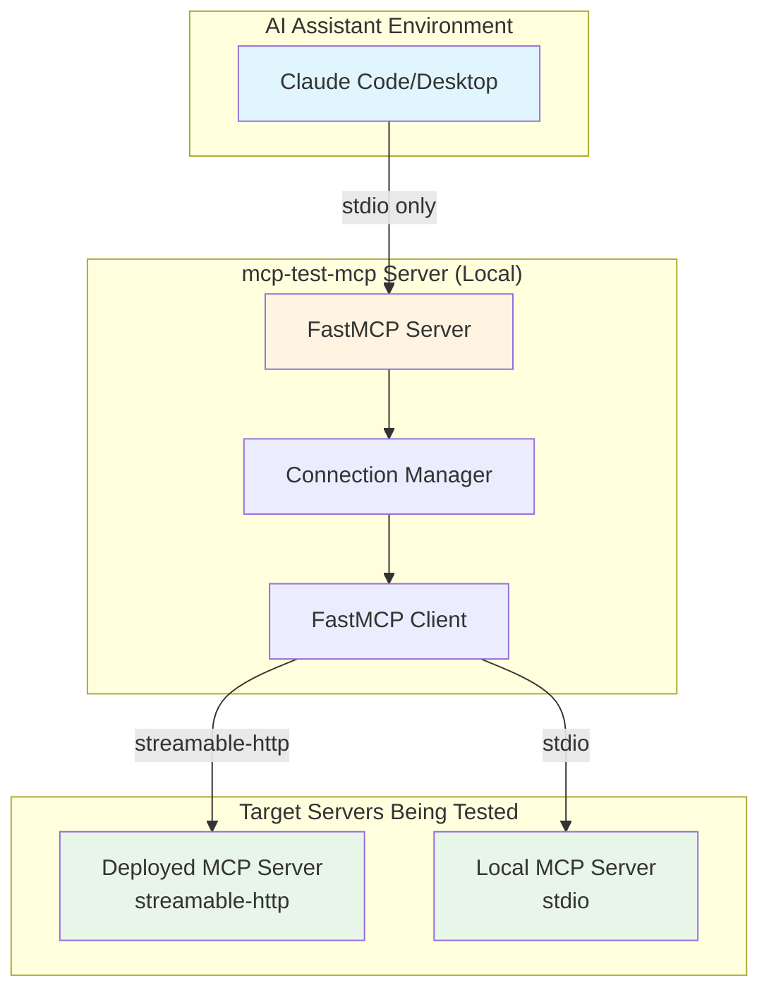
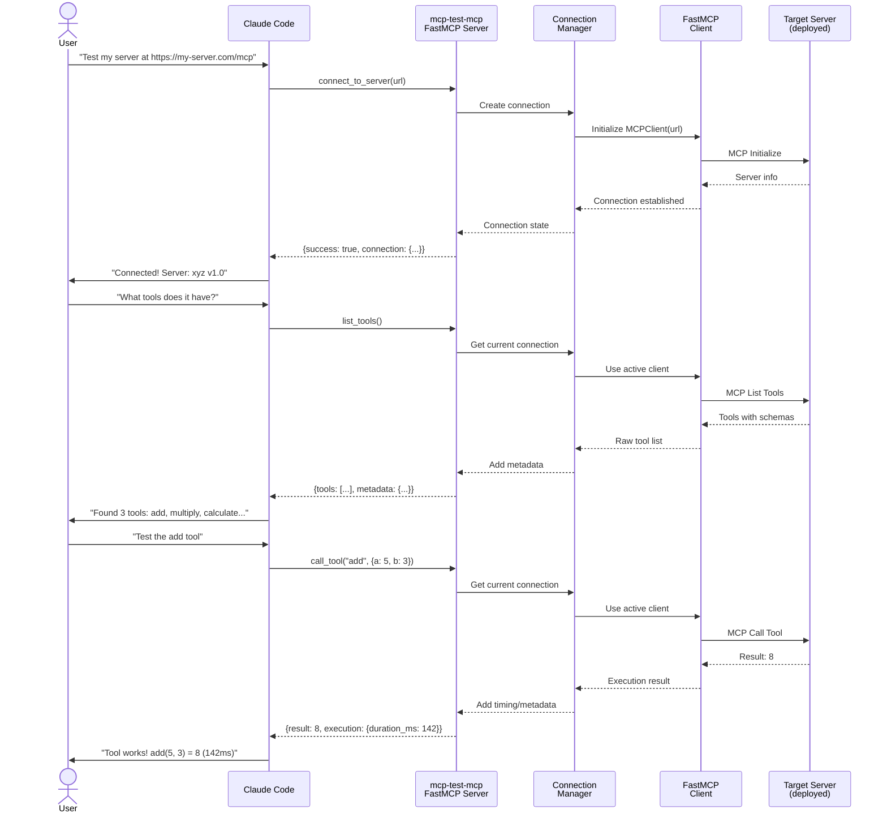

# Architectural Sketch - mcp-test-mcp

## Executive Summary

**mcp-test-mcp** is an MCP server that gives AI assistants the ability to test other MCP servers. It acts as a bridge - appearing as a normal MCP server to AI assistants (Claude Code, Claude Desktop), while internally functioning as an MCP client to connect to and test target servers.

**Primary Use Case**: Testing deployed MCP servers (on OpenShift/cloud) during agent development
**Secondary Use Case**: Testing local MCP servers during development

## System Overview



## Component Architecture

### 1. FastMCP Server Layer

**Responsibility**: Expose testing tools to AI assistants via MCP protocol

**Key Characteristics**:
- Built with FastMCP v2 framework
- Exposes 9 tools with `mcp__mcp_test_mcp__` prefix
- Runs locally via stdio transport only
- Stateful - maintains connection state across tool calls

**Advertised Tools**:
- Connection: `connect_to_server`, `disconnect`, `get_connection_status`
- Tool Testing: `list_tools`, `call_tool`
- Resource Testing: `list_resources`, `read_resource`
- Prompt Testing: `list_prompts`, `get_prompt`

**Deployment**:
- **Local only**: Runs via stdio as subprocess of Claude Code/Desktop
- No remote deployment needed - it's a local development tool

### 2. Connection Manager

**Responsibility**: Manage state and lifecycle of connections to target servers

**Key Characteristics**:
- Global connection state (one active connection at a time for MVP)
- Connection metadata tracking (URL, transport, timestamps, statistics)
- Error handling and timeout management
- Connection validation

**State Model**:
```python
ConnectionState:
  - current_connection: Optional[MCPClient]
  - server_url: str
  - transport: "streaming-http" | "stdio"
  - connected_at: datetime
  - server_info: {name, version}
  - statistics: {tools_called, resources_read, prompts_retrieved}
```

**Lifecycle**:
1. `connect_to_server(url)` → Create client, establish connection, store state
2. Tool calls → Use `current_connection` to proxy requests
3. `disconnect()` → Close connection, clear state
4. Connection persists across multiple tool calls until explicit disconnect

### 3. FastMCP Client Layer

**Responsibility**: Communicate with target MCP servers being tested

**Key Characteristics**:
- Uses FastMCP Client library (internal component)
- Auto-detects transport from URL
- Handles protocol-level communication (initialize, list, call)
- Returns raw MCP responses for verbosity

**Communication Pattern**:
- **Initialization**: Handshake with target server, exchange capabilities
- **Discovery**: List tools/resources/prompts with full schemas
- **Execution**: Call tools, read resources, get prompts
- **Error Handling**: Protocol errors, timeouts, invalid responses

## Data Flow - Primary Use Case

### Scenario: Testing a Deployed Server



## Integration Points

### Upstream: AI Assistants

**How mcp-test-mcp is Used**:
- User configures mcp-test-mcp in Claude Code/Desktop MCP settings
- Server starts and advertises tools
- AI assistant sees tools with `mcp__mcp_test_mcp__` prefix
- AI calls tools like any other MCP tool

**Configuration** (stdio example):
```json
{
  "mcpServers": {
    "mcp-test-mcp": {
      "command": "python",
      "args": ["-m", "mcp_test_mcp"],
      "transport": "stdio"
    }
  }
}
```

### Downstream: Target MCP Servers

**What Gets Tested**:
- Any MCP server implementing the protocol
- Deployed servers via streamable-http (primary use case)
- Local servers via stdio (secondary use case)

**Transport Support** (Client):
- **streamable-http**: For testing deployed MCP servers
- **stdio**: For testing local MCP servers during development
- Both transports supported in MVP via FastMCP Client auto-detection

**No Authentication** (MVP):
- Servers must be publicly accessible or on same network
- Bearer tokens and OAuth deferred to Phase 2

## State and Persistence

### In-Memory State Only

**No Database Required** - All state is ephemeral:

```
Connection State (in-memory):
  - current_connection: MCPClient instance
  - server_url: string
  - transport: enum
  - connected_at: timestamp
  - server_info: dict
  - statistics: counters
```

**Lifecycle**:
- State created on `connect_to_server`
- Maintained across tool calls during session
- Cleared on `disconnect` or server restart
- No persistence needed - each session is independent

**Statistics Tracking**:
- Counters for tools called, resources read, prompts retrieved
- Used in `get_connection_status` for debugging
- Reset on disconnect

## Key Interactions

### 1. Discovery Workflow

**User Goal**: Understand what a deployed server offers

```
1. User: "What can this server do?"
2. AI: connect_to_server(url)
3. AI: list_tools() → Get all tools with full schemas
4. AI: list_resources() → Get all resources
5. AI: list_prompts() → Get all prompts
6. AI: Reports comprehensive overview to user
```

**Critical Feature - Verbosity**:
- Must return FULL schemas, not summaries
- Prevents AI hallucination ("I found 3 tools" when there are none)
- Enables human verification of actual server capabilities

### 2. Verification Workflow

**User Goal**: Verify a specific tool works correctly

```
1. User: "Test the add tool"
2. AI: list_tools() → Confirm tool exists, get schema
3. AI: call_tool("add", {a: 5, b: 3})
4. AI: Reports result with execution metadata
5. User confirms tool is working
```

### 3. Debugging Workflow

**User Goal**: Understand why something isn't working

```
1. User: "Why is my tool failing?"
2. AI: get_connection_status() → Verify connection
3. AI: list_tools() → Check if tool exists
4. AI: call_tool(name, args) → Attempt execution
5. AI: Returns detailed error with suggestion
6. User can debug based on specific error info
```

## Boundaries and Responsibilities

### What mcp-test-mcp DOES

✅ **Connect to MCP servers** (as a client)
✅ **Discover capabilities** (tools, resources, prompts)
✅ **Execute operations** (call tools, read resources, get prompts)
✅ **Return verbose results** (full schemas, execution metadata)
✅ **Manage connection state** (one active connection)
✅ **Provide debugging info** (status, statistics, errors)

### What mcp-test-mcp DOES NOT DO

❌ **Not a UI/Inspector** - No visual interface (use MCP Inspector for that)
❌ **Not automated testing** - No test suites or CI/CD integration
❌ **Not performance testing** - No load testing or benchmarking
❌ **Not monitoring** - No alerting or long-term metrics
❌ **Not authentication broker** - Doesn't manage credentials (Phase 2)

### Separation of Concerns

- **MCP Inspector**: Visual exploration, human-operated
- **test-mcp/mcp-server-tester**: Automated CI/CD testing
- **mcp-test-mcp**: AI-assisted interactive testing during development

## Deployment Architecture

### Local Development (stdio)

```
Developer Machine:
  ┌─────────────────────┐
  │  Claude Code        │
  └──────────┬──────────┘
             │ stdio
  ┌──────────▼──────────┐
  │  mcp-test-mcp       │
  │  (Python process)   │
  └──────────┬──────────┘
             │ streaming-http
             │
             │ Internet/Network
             │
  ┌──────────▼──────────┐
  │  Target MCP Server  │
  │  (deployed)         │
  └─────────────────────┘
```

**Setup**:
- Install mcp-test-mcp Python package: `pip install mcp-test-mcp`
- Configure in Claude Code MCP settings (see configuration example above)
- Runs as child process when Claude Code starts
- Tests both deployed servers (via streamable-http) and local servers (via stdio)

## Non-Functional Considerations

### Security

**MVP (Minimal)**:
- No authentication required for target servers
- mcp-test-mcp itself relies on MCP client security model
- Connections to target servers are direct (no credential storage)

**Phase 2**:
- Bearer token support for authenticated servers
- OAuth flow support
- Secure credential storage

### Scalability

**Not a Concern**:
- Single connection at a time (by design)
- Lightweight operations (discovery, single tool calls)
- No heavy processing or data storage
- Stateless (except ephemeral connection state)
- Local tool - no scaling considerations needed

### Resilience

**Connection Handling**:
- Timeout on connect attempts (30s default)
- Timeout on tool calls (configurable, 60s default)
- Clear error messages for connection failures
- Automatic cleanup on disconnect

**Error Propagation**:
- Return errors from target server as-is (don't mask)
- Add context (which tool, which server, when)
- Suggest next steps in error responses

### Observability

**Logging** (to stdout):
- Connection events (connect, disconnect)
- Tool calls (name, arguments, duration)
- Errors (full traceback for debugging)
- Structured format (JSON lines)

**Metrics** (Phase 2):
- Prometheus endpoint for monitoring
- Connection count, tool call count, error rate
- Response time histograms

**No Tracing** (MVP):
- Simple enough to debug from logs
- Could add OpenTelemetry in Phase 2 if needed

## What We're NOT Building (Yet)

### Phase 2 Features (Deferred)

- **Named connections**: Multiple simultaneous connections
- **Authentication**: Bearer tokens, OAuth flows
- **Advanced discovery**: Schema validation, argument validation helpers
- **Debugging tools**: Raw request/response inspection

### Explicitly Out of Scope

- **UI/visualization**: Use MCP Inspector instead
- **Automated testing**: Use test-mcp or similar
- **Performance testing**: Use dedicated load testing tools
- **Production monitoring**: Use observability stack
- **Server development tools**: Not an MCP server generator/template

## Open Questions

### Connection Model
- ✅ **Decided**: Simple global state (one connection at a time)
- Alternative: Named connections (deferred to Phase 2)

### Transport Support
- ✅ **Decided**: Client supports both streamable-http and stdio (MVP)
- Server uses stdio only (local tool)
- Primary use case: Testing deployed servers via streamable-http
- Secondary use case: Testing local servers via stdio

### Authentication
- ✅ **Decided**: Defer all auth to Phase 2
- Start with public/network-accessible servers only

### Error Handling
- **Question**: How much error detail to return?
- **Tentative**: Return full errors from target server + context
- **Rationale**: More info = better debugging

### Timeout Values
- **Question**: What are appropriate timeouts?
- **Tentative**: 30s connect, 60s tool call
- **Refinement**: Make configurable via environment variables

### Tool Call Validation
- **Question**: Validate arguments before sending to target?
- **Tentative**: No validation in MVP - let target server validate
- **Rationale**: Simpler, less code, matches real usage

## Success Criteria

### MVP is complete when:

1. ✅ **Connect to deployed MCP server via streaming-http**
2. ✅ **List tools with full schemas** (verbose output)
3. ✅ **Call a tool and get results** (with execution metadata)
4. ✅ **List resources and prompts** (complete metadata)
5. ✅ **AI assistant can verify "server works"** (without curl)
6. ✅ **Errors are clear and actionable** (what failed, why, what to try)

### Developer Experience Metrics

**Before mcp-test-mcp**:
- AI tries curl → fails → breaks working code
- Days of rework

**After mcp-test-mcp**:
- AI uses native tools → verifies server → provides accurate guidance
- Minutes to verify, hours saved

## Implementation Notes

### Technology Stack

- **Language**: Python 3.11+
- **Framework**: FastMCP v2
- **Data Validation**: Pydantic v2
- **Testing**: pytest with 80%+ coverage
- **Distribution**: Python package (PyPI or internal package repo)

### Project Structure

```
mcp-test-mcp/
├── pyproject.toml             # Python package configuration
├── README.md
├── LICENSE
├── .gitignore
├── src/
│   └── mcp_test_mcp/
│       ├── __init__.py
│       ├── __main__.py        # Entry point for python -m
│       ├── server.py          # FastMCP server setup
│       ├── connection.py      # Connection manager
│       ├── models.py          # Pydantic models
│       └── tools/             # Tool implementations
│           ├── __init__.py
│           ├── connection.py  # connect, disconnect, status
│           ├── tools.py       # list_tools, call_tool
│           ├── resources.py   # list_resources, read_resource
│           └── prompts.py     # list_prompts, get_prompt
├── tests/
│   ├── __init__.py
│   ├── conftest.py            # Pytest fixtures
│   ├── test_server.py
│   ├── test_connection.py
│   └── test_tools/
│       ├── test_connection_tools.py
│       ├── test_tool_tools.py
│       ├── test_resource_tools.py
│       └── test_prompt_tools.py
└── docs/
    ├── usage.md
    └── examples/
        └── claude-code-config.json
```

### Key Dependencies

- `fastmcp >= 2.0.0` - MCP server and client framework
- `pydantic >= 2.0` - Data validation and schemas
- `pytest >= 7.0` - Testing framework
- `pytest-asyncio >= 0.21` - Async test support
- `pytest-cov >= 4.0` - Coverage reporting

### Development Workflow

1. Local development with venv: `python -m venv .venv && source .venv/bin/activate`
2. Install package: `pip install -e ".[dev]"`
3. Test with pytest: `pytest --cov=src --cov-report=html`
4. Build package: `python -m build`
5. Verify with Claude Code using mcp-test-mcp to test real MCP servers

## Next Steps

After sketch approval:

1. **Run `/tech-stack`**: Lock in specific framework versions and packages
2. **Run `/propose`**: Create detailed technical proposal
3. **Implementation**: Build the MVP
4. **Testing**: Verify with real deployed MCP servers
5. **Documentation**: Usage guide for developers

---

**This sketch captures the MVP architecture for mcp-test-mcp - an MCP server that enables AI assistants to test other MCP servers natively, breaking the broken loop of trying curl and "fixing" working code.**
